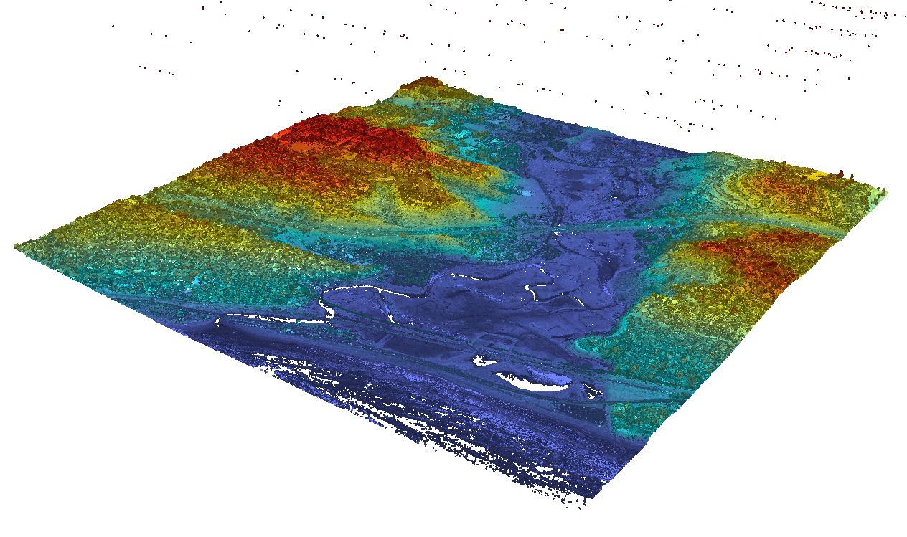
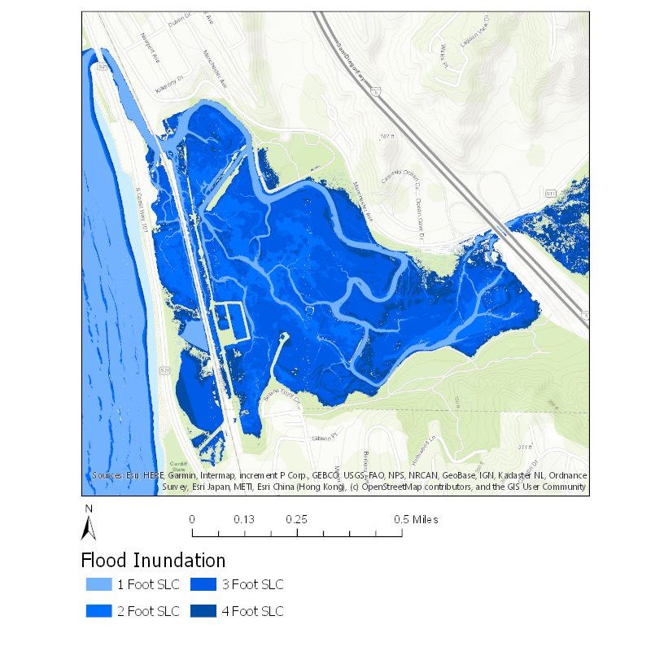

```{r setup, include=FALSE}
knitr::opts_chunk$set(echo = FALSE)
```

For my GIS associate degree capstone project at Palomar Community College, I performed a 'bathtub model' analysis of San Elijo lagoon to visualize the impact of projected sea level rise. 

First, I used esri ArcGIS Pro to generate a high resolution (1.5 feet) digital surface model from USGS LiDAR point-cloud data (Figure 1). The digital surface model required some data cleaning and gap filling, which was accomplished through manual and automatic interpolation.



Next, I used Map Algebra expressions to generate new raster layers from the digital surface model showing areas of the lagoon where the elevation was below a one, two, three, and four foot rise in local mean sea level (MSL), recorded from a NOAA tidal gauge off the coast of La Jolla, CA. 

I produced several maps and a final report for this project. Figure 2 shows an amalgamation of these maps, visualizing potential inundation impacts of one, two, three, and four feet increases in mean sea level.



I was selected to present this project as a poster at the 26th National Advanced Technological Education (ATE) Principal Investigators’ Conference in Washington, D.C. as a representative of Palomar College (Figure 3).


The project used Mean Sea Level (MSL) for baseline sea level as opposed to the Mean High High Water (MHHW) and did not account for potential storm surges. It also did not account for future changes to the lagoon from construction and mitigation or from natural processes such as accretion.