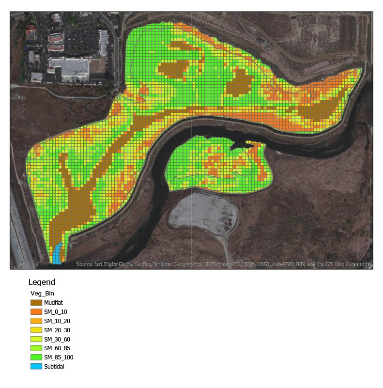

```{r setup, include=FALSE}
knitr::opts_chunk$set(echo = FALSE)
```

Between September, 2019 and April, 2020, I worked as a wetlands field and lab assistant at the San Onofre Nuclear Generating Station Mitigation Monitoring Program (SONGS MMP). The SONGS program is administered through UC Santa Barbara's Marine Science Institute and conducts independent, long-term monitoring and evaluation of San Dieguito Lagoon and three reference sites. The program is a condition of the coastal development permit issued to Southern California Edison by the California Coastal Commission for the operation of SONGS Units 2 and 3. Part of my work there was GIS-oriented and I received additional credits towards my associate degree in GIS at Palomar College through these GIS project. 

**All images used with permission from SONGS MMP.**

## Machine Learning Classification

One of the GIS projects I completed for SONGS MMP was piloting a validation methodology for the project's vegetative coverage standard. In order for Southern California Edison to receive mitigation credit for wetlands restoration, a certain percentage of the San Dieguito Lagoon project area must be covered by wetland vegetation. This is assessed by a large, third-party company that uses aerial imaging and multi-spectral sensors. However, the principal investigators wanted to find a way to validate the results in-house.

I spent several weeks training esri ArcGIS Pro's supervised machine learning image classification software on multi-spectral drone imagery in San Dieguito Lagoon to classify vegetation in the lagoon. Figure 1 shows the drone imagery, while figure 2 shows the classification results.


I developed the methodology workflow and file organization schema for the validation process. However, because the imagery was not of great quality due to conditions on the day of the drone flight, we were not completely confident with the results.

## Grid Classification

Another GIS project I completed at SONGS MMP was converting the raw vegetative coverage results from the aforementioned remote sensing company into a gridded format used by the principle investigators to determine whether project standards were met. The results are shown in figure 3.



## Project Mapping

Another part of the GIS work at SONGS MMP was mapping project assets--such as air and water quality loggers--using RTK GPS. I also created maps used in project presentations for the scientific advisory panel and the public. Figure 4 shows one example.


