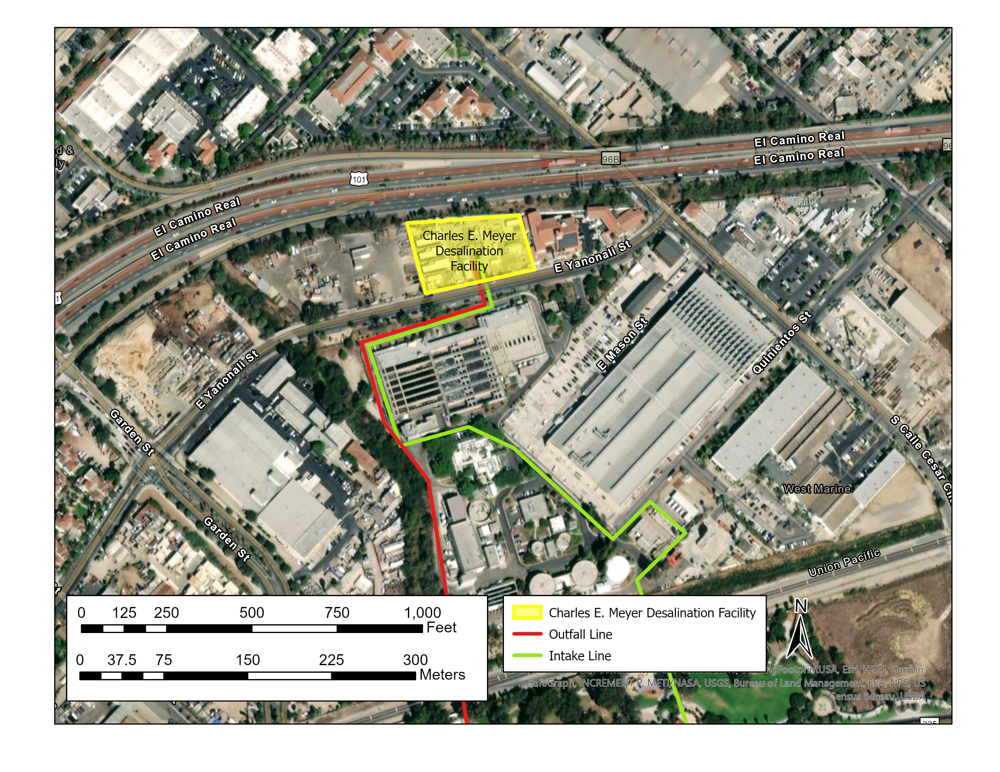
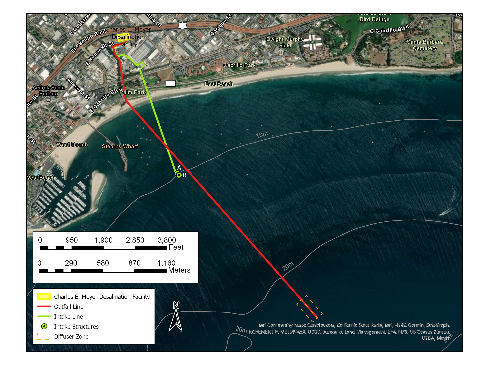
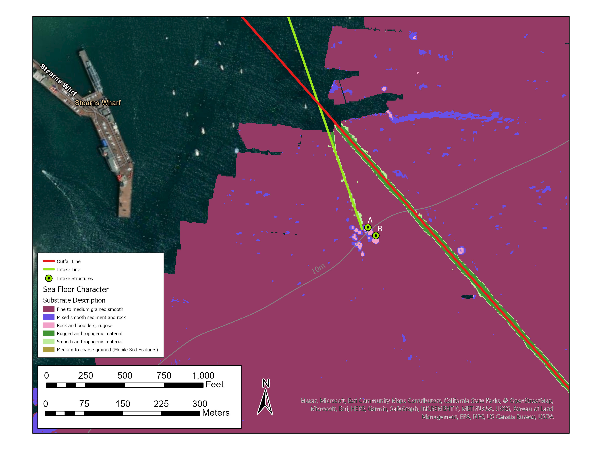
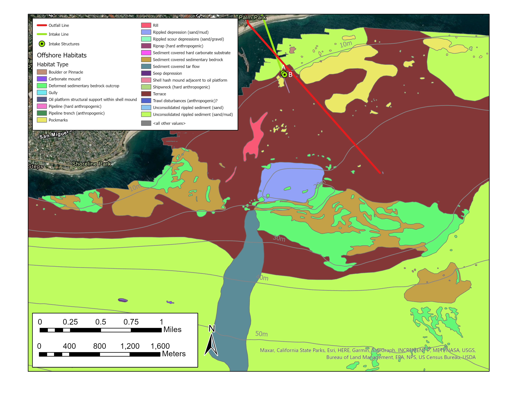
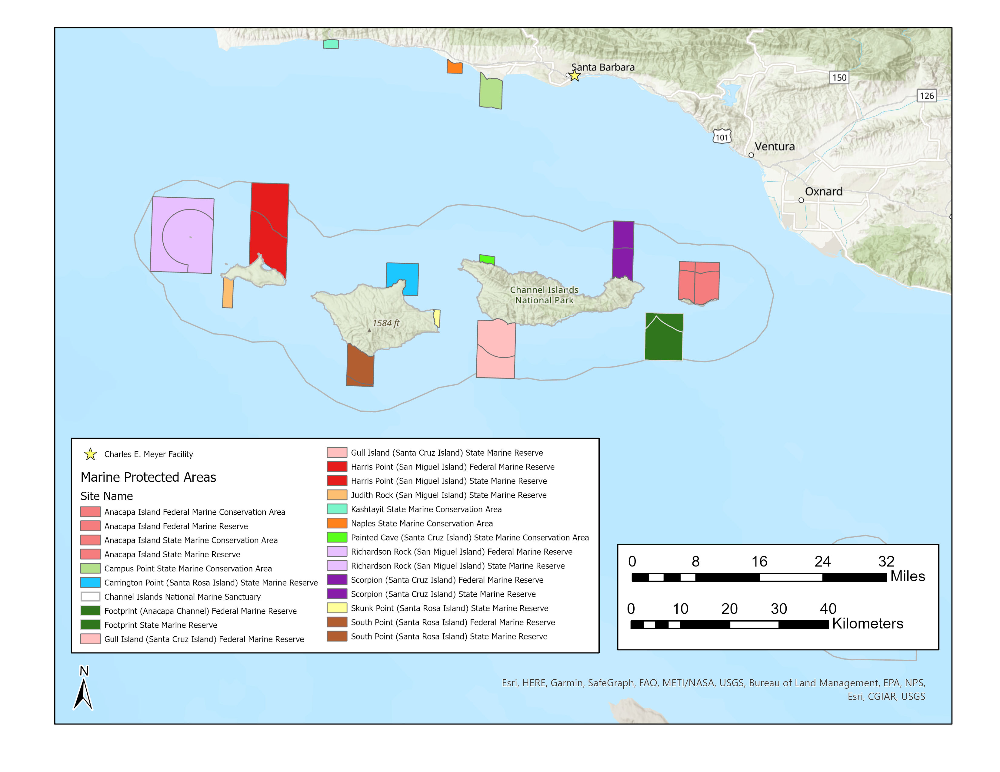

```{r setup, include=FALSE}
knitr::opts_chunk$set(echo = FALSE)
```

Over the summer of 2021, I worked on a three member research team to conduct a comprehensive study of methodologies to assess the ecological impact of the Charles E. Meyer desalination facility on the local marine environment. The facility has a unique position within the current regulatory environment; these special circumstances made it necessary to research several alternate methods of assessment.

The team presented a 70 page report which provided information regarding the physical and biological characteristics of the marine environment offshore of the desal plan and detailed various methods of impact assessment. As the primary GIS specialist on the team, I produced a majority of the maps provided in the report, a sample of which are shown in figures 1-7.











