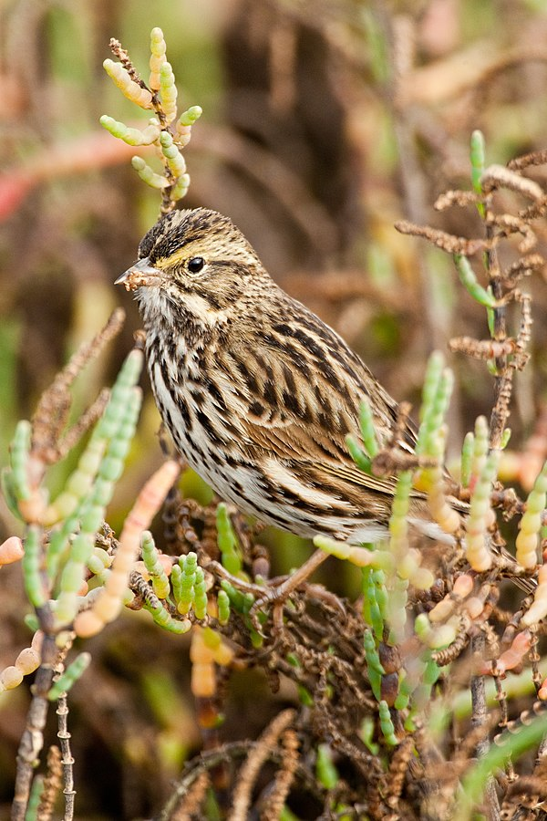
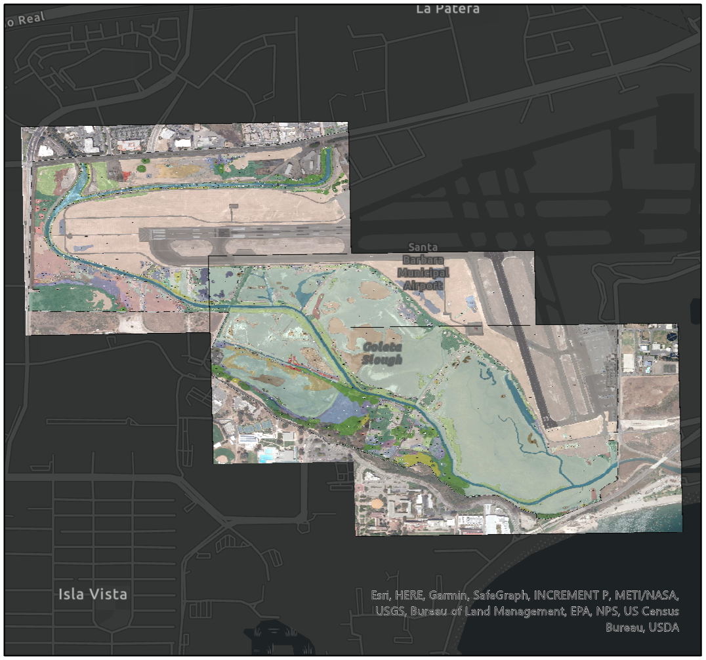
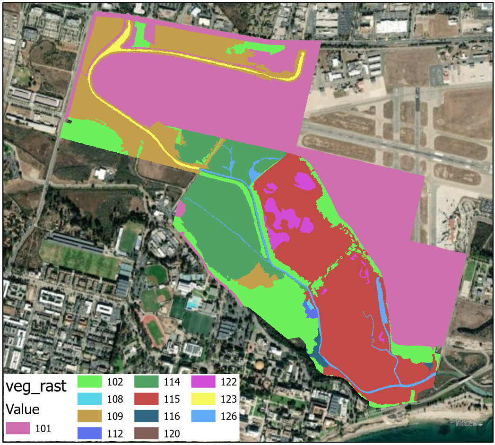
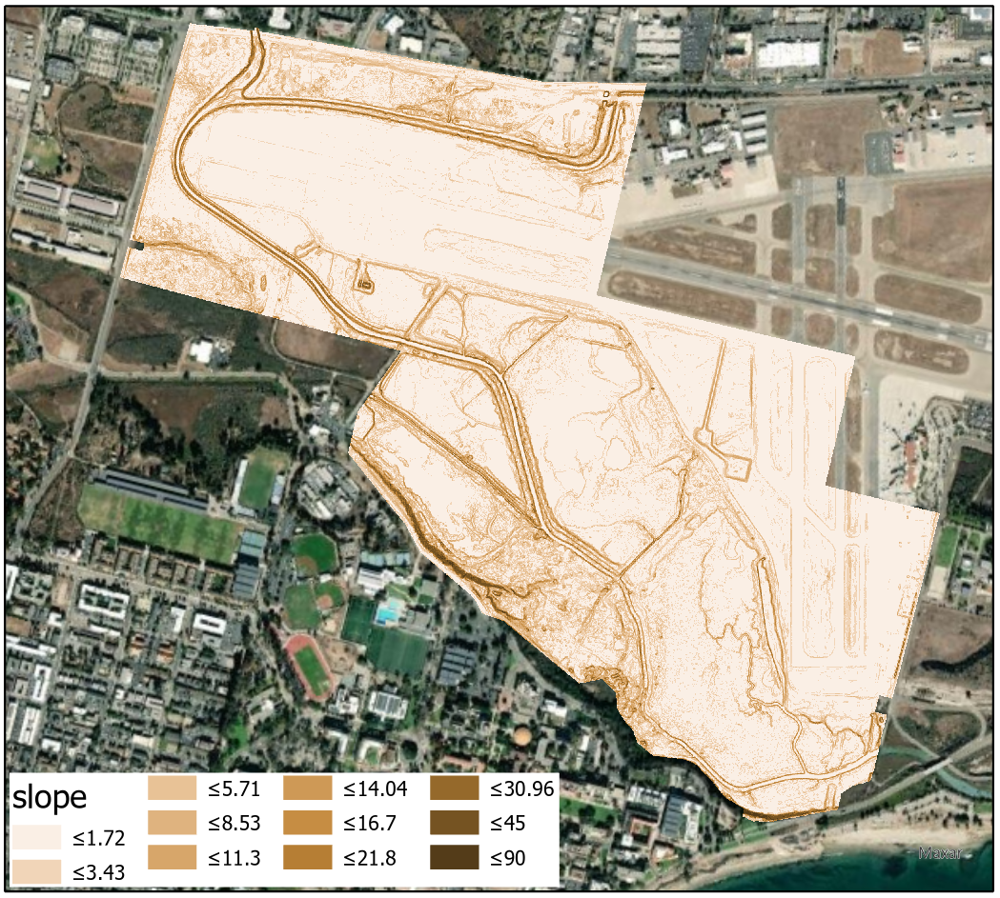
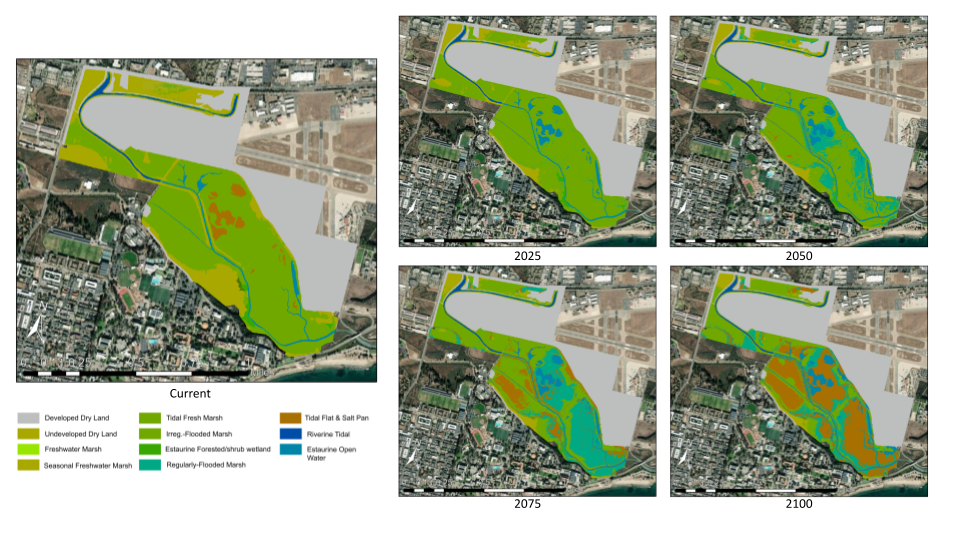
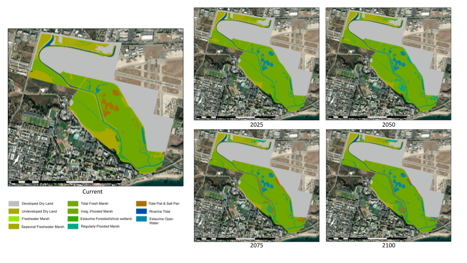

```{r setup, include=FALSE}
knitr::opts_chunk$set(echo = FALSE)
```

At UCSB's Bren School of Environmental Science & Management, my masters specialization was conservation planning. This specialization provided me with highly technical training in strategies and tactics for achieving conservation goals. The conservation planning coursework focused on ecological inventory and monitoring, data analysis, mapping, and modeling. This was in addition to advanced courses in policy, land/water use planning, and economics.

An additional requirement of the specialization was a practicum project approved by faculty. For this project, my partner and I developed an assessment of sea level rise impacts on Belding's Savannah Sparrow habitat in Goleta Slough.

Belding's Savannah Sparrow (Figure 1) is a state-listed endangered subspecies of the Savannah Sparrow. The species is highly dependent on saltmarsh habitat, particularly dense patches of Salicornia (pickleweed). The south coast of Santa Barbara County is the northern extent of the sparrow's range. Because Goleta slough is managed for multiple objectives--it contains a municipal airport, gas company facilities, and Goleta Sanitary District facilities--its importance from an ecological/biodiversity perspective is somewhat at odds with the wider urban context.



Our project evaluated the risk of sea level rise to Salicornia in the slough, a habitat which has already been severely reduced due to urban development. To accomplish this, we used the Sea Level Affecting Marshes Model (SLAMM), a GIS program developed by Warren Pinnacle Consulting with funding from The Nature Conservancy and the US EPA. 

## Inputs for SLAMM

SLAMM uses raster inputs including slope, a digital elevation model, and a National Wetlands Inventory (NWI) classification raster, as well as physical parameters such as accretion rate, salt line, mean tide line, and sea level rise scenario to simulate dynamic effects of sea level rise on marshes over a user-defined period of time.

To build the inputs, we first used ArcGIS Pro to georeference a PDF of planning documents for the Santa Barbara Airport, which included a vegetation survey of the slough (Figure 2).



Next, we used ArcGIS Pro's unsupervised machine learning image classification to segment the georeferenced image and then merged the resulting polygons together to form a vegetation layer that included delineation of existing Salicornia patches. We overlaid a National Wetlands Inventory over this to develop our NWI layer (Figure 3).



Finally, we created a digital elevation model and slope layer using USGS 3DEP data (Figure 4). These were used as inputs for SLAMM.



## Running SLAMM

With all the GIS input layers entered, we parameterized the physical properties of the simulation using tidal data from NOAA gauges and slough characteristics from available literature. We made some assumptions, including accretion rate values. Because of the uncertainty around accretion rate, which is subject to variance from several factors including upstream erosion, we decided to run the simulation twice: once using an accretion rate of 1 mm per year and again for an accretion rate of 5 mm per year. According to literature, this reflects the likely range predicted by experts. 

We ran each simulation until the year 2100 under a sea level rise scenario of 1 meter increase by the year 2100. The results for the 1 mm accretion rate are shown in Figure 5. Results for the 5 mm accretion rate are shown in Figure 6.





By overlaying these layers over our original vegetation layer and using map algebra, we were able to determine the amount of Salicornia habitat area lost or gained under both accretion scenarios. Figure 7 shows a map of the Salicornia habitat area lost or gained considering a 1 mm accretion rate. Figure 8 shows the same considering a 5 mm accretion rate.


