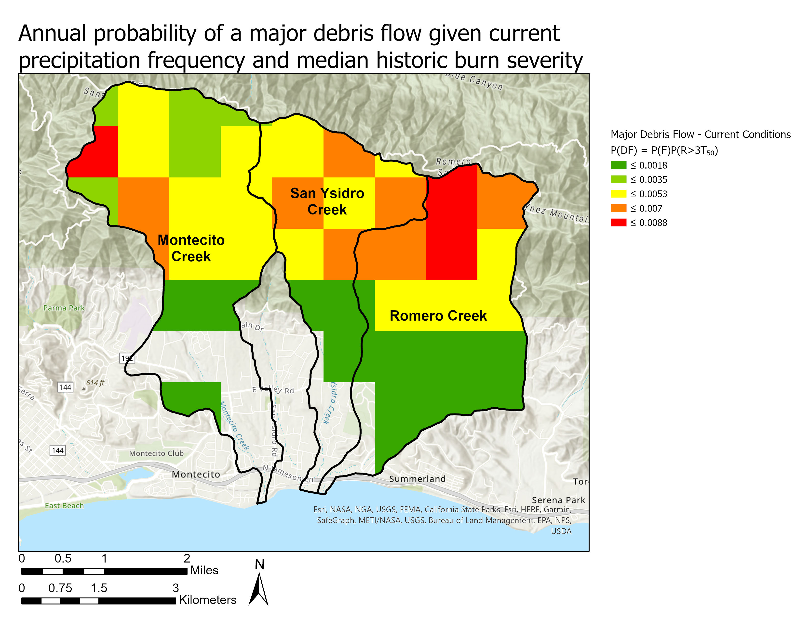
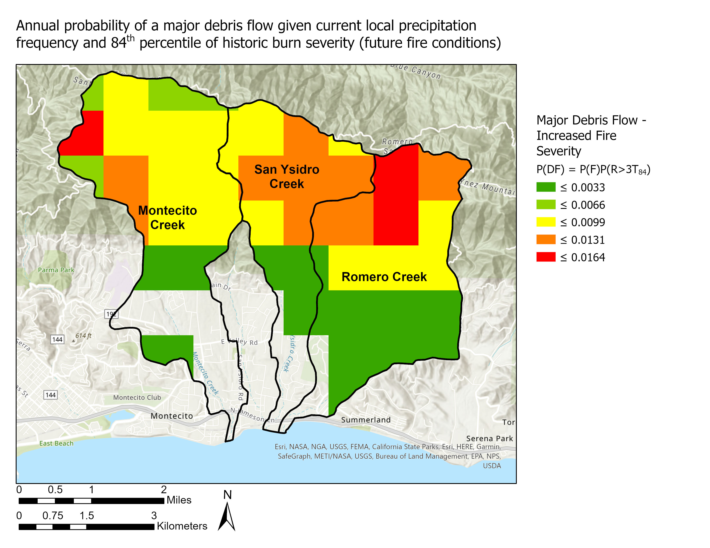

```{r setup, include=FALSE}
knitr::opts_chunk$set(echo = FALSE)
```

For my master's group project at UCSB's Bren School of Environmental Science & Management, I worked on a team of four to provide sediment management recommendations on behalf of our client, South Coast Habitat Restoration (SCHR). SCHR is a non-profit organization based in Carpinteria, CA who work on watershed restoration projects throughout Santa Barbara and Ventura counties.

Fire and sediment transport are two paramount concerns for managers of Santa Barbara County, where steep, boulder strewn transverse mountain ranges meet the coast. Since the 2018 Montecito Mudslides, there has been a renewed focus on debris flow hazard mitigation and sustainable sediment management. SCHR has built strong relationships with various management agencies, particularly Santa Barbara County Flood Control District, which manages watershed infrastructure and flood channels throughout the county.

Using spatial modeling tools, cost-benefit analysis, and literature review, our team prepared a detailed report providing recommendations in several key management areas such as debris flow hazard, sediment management, habitat conservation, and climate change adaptation. Our study area focused on three Montecito-area watersheds, which were highly impacted in the 2018 Montecito Mudslides (Figure 1).


## Spatial Modeling

Along with another member of the team, I was a GIS specialist for the project. My GIS teammate and I were primarily tasked with the project's spatial modeling, which included assessing post-fire debris flow likelihood and potential magnitude (debris volumes) under various fire and precipitation scenarios. We turned to empirical models developed by USGS geologists/hydrologists to model potential scenarios.

### Likelihood

One of the primary datasets used in our report was gridded estimates of postfire debris flow in the southern California region developed by USGS geologists Jason Kean and Dennis Staley (2021). We clipped this dataset to our study area and performed statistical analyses to develop debris flow metrics for our report. Figure 2 shows modeling of the annual likelihood of a major post-fire debris flow event given median historic fire severity and current precipitation records. Figure 3 shows likelihood modeling with an increase of fire severity. Figure 4 shows likelihood modeling with an 18 percent increase in average precipitation intensity.






We also completed this same analysis for non-major debris flow. The modeling is based on the probability of fire AND the probability of a rain event exceeding a threshold for a debris flow. Because the probability of a rain event exceeding the threshold is 100 percent for a non-major debris flow in a given year, the probability of debris flow relies on the probability of a fire. This modeling held the probability of fires as the number of historic fires divided by the number of years on record.

### Magnitude

Next, we adopted an multi-variate regression equation by Gartner et al. (2014) to predict potential debris flow volumes within two years of a fire. We used spatial variables from the study watersheds (relief, burned area, and 15-minute peak rainfall intensity) to perform the analysis. Figure 5 shows the results from this analysis.


